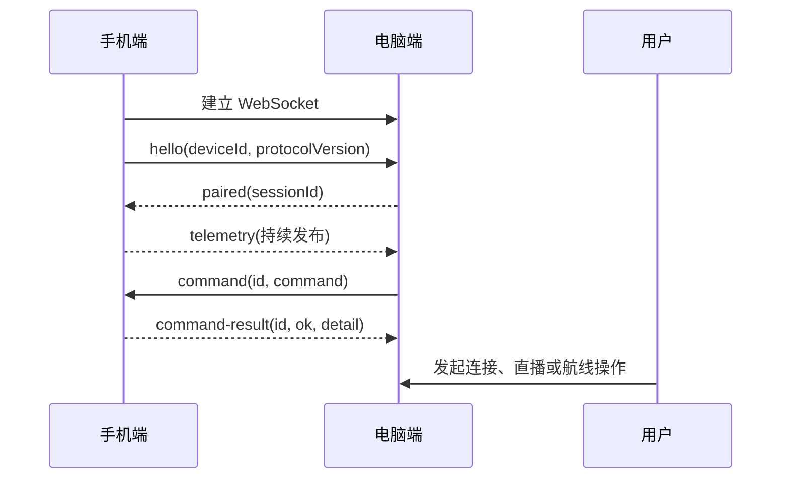

# MSDK Relay 手机端程序契约

**文档用途：** Sky Command 电脑端与 MSDK Relay 手机端共同使用的说明书
**当前版本：** v1.1
**状态：** 手机端重构的总契约
**适用范围：** `D:\Desktop\MSDK-relay` 中的新手机端项目

> 这份文档回答三个问题：手机端负责什么、电脑端怎样调用手机端、双方遇到异常时应怎样理解和处理。
> 电脑端 agent 和手机端 agent 都必须以这份文档为准。具体代码结构可以变化，但本文件规定的对外行为不能被悄悄改变。

底层帧格式、字段长度限制和状态机见：

- [`src/modules/relay-gateway/CONTRACT.md`](src/modules/relay-gateway/CONTRACT.md)
- [`src/modules/relay-gateway/protocol-core/CONTRACT.md`](src/modules/relay-gateway/protocol-core/CONTRACT.md)
- [`docs/2026-08-09-mobile-relay-design.md`](docs/2026-08-09-mobile-relay-design.md)

---

## 1. 一句话定义

手机端是连接 DJI 设备的 Android 中继程序。

电脑端负责界面、地图、航线文件选择与生成、媒体接收，以及向用户发起操作；手机端负责连接遥控器和飞行器，调用 DJI MSDK 完成设备侧操作，并把设备状态和操作结果回传给电脑端。

手机端不是第二个电脑端，也不是飞行控制器。它只执行本契约列出的设备侧能力。

---

## 2. 手机端能做什么

手机端必须支持以下能力：

1. 连接遥控器和飞行器，并向电脑端报告连接状态。
2. 执行遥控器与飞行器的配对操作，并报告配对状态。
3. 持续发布设备遥测，包括连接状态、飞行状态、电量、位置、直播状态和航线任务状态。
4. 接收电脑端的 RTMP 直播命令，让飞行器视频推送到电脑端指定的 RTMP 地址。
5. 接收电脑端的 KMZ 航线文件，校验完整性并暂存。
6. 根据电脑端命令生成、上传、开始、暂停、恢复和停止航线任务。
7. 在连接断开、设备未就绪或 DJI SDK 拒绝操作时，返回明确的失败结果，而不是假装操作成功。

这些能力分别属于以下一级模块：

| 一级模块 | 唯一职责 |
| --- | --- |
| `app-runtime` | Android 应用生命周期、前台运行、权限和模块组装 |
| `relay-settings` | 电脑端地址、手机设备身份和本地设置 |
| `relay-gateway` | 与电脑端建立 WebSocket 会话，收发协议帧，分发命令和结果 |
| `device-connection` | DJI MSDK 初始化，以及遥控器、飞行器和配对状态 |
| `telemetry` | 读取、整理并发布遥测 |
| `wayline-mission` | KMZ 航线传输、校验、暂存、上传和任务控制 |
| `live-stream` | RTMP 地址校验、直播启动、停止和状态回报 |

模块之间应通过清晰的接口协作。`relay-gateway` 不得直接依赖 DJI SDK；业务模块不得自己创建 WebSocket 连接。这样更换网络库、JSON 库或 DJI SDK 版本时，不需要同时修改所有模块。

### 2.1 模块拆分原则

一级模块代表一个完整的业务职责，二级模块代表该职责内部一个可以独立理解、独立测试和独立替换的工作单元。

每个二级模块都必须满足：

- 有一个明确的负责人：它只对一类结果负责；
- 有一个小而稳定的外部接口：调用方不需要知道内部类、线程或第三方 SDK；
- 有明确的输入、输出、前置条件、失败方式和生命周期；
- 有自己的模块契约文件，先写契约再写实现；
- 不直接访问兄弟模块的内部状态，只使用对方公开的接口；
- 不重复保存另一模块已经拥有的状态；
- 可以用内存替身或纯 JVM 测试验证主要业务规则。

不要为了追求“模块数量多”而拆分。只有当一个职责可以在不改动调用方的情况下独立变化，或者确实需要独立测试、独立替换时，才建立二级模块。简单的纯函数可以留在所属二级模块内部，不必单独建模块。

### 2.2 手机端二级模块地图

下面的名称是手机端重构的规范名称。实现时目录名、包名和契约文件名应保持一致；每个二级模块目录都必须先创建 `CONTRACT.md`。

#### `app-runtime`

| 二级模块 | 只负责 | 明确不负责 |
| --- | --- | --- |
| `app-bootstrap` | 创建模块、连接依赖、定义启动顺序和关闭顺序 | 不实现连接、遥测、直播或航线业务 |
| `foreground-service` | 让中继程序在 Android 前台服务中稳定运行，处理服务启停 | 不保存业务状态，不调用 DJI 业务接口 |
| `permission-coordinator` | 请求和观察 Android 权限、USB 访问授权及其结果 | 不决定业务命令是否允许执行 |
| `android-permission-adapter` | 将 Android 运行时权限、Activity Result 和 USB 广播适配到 `PermissionPort` | 不改变权限策略，不启动服务，不调用 DJI 或业务模块 |

`app-runtime` 是组合根。其他模块不得反向依赖 `app-runtime`，也不得自己读取 Activity、Service 或 Android 全局对象。

#### `relay-settings`

| 二级模块 | 只负责 | 明确不负责 |
| --- | --- | --- |
| `settings-store` | 保存、读取、迁移和恢复本地设置 | 不解释设置对业务操作的影响 |
| `endpoint-settings` | 管理电脑端地址、端口和连接参数的格式与合法性 | 不建立网络连接 |
| `device-identity` | 创建并长期保存稳定的 `deviceId` | 不把 `deviceId` 当作认证密码，不管理会话 |

`relay-settings` 不得依赖 `relay-gateway`。gateway 只读取已经校验好的设置。

#### `relay-gateway`

| 二级模块 | 只负责 | 明确不负责 |
| --- | --- | --- |
| `protocol-core` | 消息帧模型、编码、解码和协议字段校验 | 不建立网络，不调用 Android、DJI 或文件系统 |
| `transport-adapter` | 把一种网络库的连接、接收、发送和关闭能力适配为统一传输接口 | 不解释消息类型，不执行业务命令 |
| `connection-session` | 单个电脑会话的握手、状态、会话代次和断线失效 | 不决定遥测、直播或航线业务规则 |
| `command-dispatcher` | 按命令名找到处理器、校验命令方向、关联命令 ID 和返回结果 | 不实现具体命令，不调用 DJI SDK |
| `mission-transfer` | 管理航线帧的顺序、大小、摘要、替换和取消，并把完整字节交给暂存接口 | 不解析 DJI WPMZ 业务，不上传或执行航线 |
| `outbound-publisher` | 对外发送帧、保持发送顺序、处理发送失败和旧会话隔离 | 不生成遥测内容，不决定发送什么业务数据 |

`relay-gateway` 的详细二级模块契约见 [`src/modules/relay-gateway/CONTRACT.md`](src/modules/relay-gateway/CONTRACT.md)。gateway 是手机端唯一的电脑通信入口；任何业务模块都不得直接依赖 WebSocket 或网络库。

#### `device-connection`

| 二级模块 | 只负责 | 明确不负责 |
| --- | --- | --- |
| `sdk-lifecycle` | DJI SDK 注册、初始化、注销和 SDK 可用状态 | 不执行配对、直播或航线任务 |
| `dji-operation-coordinator` | 为所有 DJI SDK 操作提供统一串行执行、超时和取消策略 | 不理解具体业务命令，不决定操作是否应该执行 |
| `device-state-store` | 保存 SDK、遥控器、飞行器和配对的唯一设备状态快照 | 不生成遥测 JSON，不发送网络消息 |
| `remote-controller-link` | 遥控器连接状态、型号和固件等遥控器侧信息 | 不判断飞行器是否连接 |
| `aircraft-link` | 飞行器和飞控连接状态、机型和基础设备连接信息 | 不执行航线和直播命令 |
| `pairing-controller` | 请求开始/停止配对并维护配对状态 | 不直接管理 WebSocket 会话，不发布完整遥测 |
| `device-capability-reader` | 根据当前设备型号和连接状态判断设备能力 | 不执行能力对应的业务操作 |

`device-connection` 是 DJI 设备连接事实和 DJI 操作执行入口的唯一来源。其他模块只能读取它提供的只读状态、能力和操作调度接口，不能自己再次读取 DJI 连接状态，也不能自己创建 DJI 操作线程。

#### `telemetry`

| 二级模块 | 只负责 | 明确不负责 |
| --- | --- | --- |
| `snapshot-assembler` | 从各公开状态接口收集一次一致的遥测快照 | 不发送网络消息，不调用 DJI 原始 API |
| `capability-calculator` | 把设备状态转换为电脑端可理解的能力字段 | 不执行能力对应的操作 |
| `telemetry-command-handler` | 处理 `telemetry.read`，立即生成并返回一次遥测快照 | 不负责持续发布，不解析其他业务命令 |
| `telemetry-publisher` | 按状态变化或时间策略发布快照，处理合并、节流和断线后的恢复发布 | 不修改设备状态，不解释命令 |

`telemetry` 不保存另一份设备真相。它只负责把状态转换成对外快照；`live-stream` 和 `wayline-mission` 必须通过只读状态接口提供自己的状态。

`telemetry.read` 由 `telemetry-command-handler` 处理；持续遥测由 `telemetry-publisher` 处理。两者都读取同一个 `device-state-store` 和业务状态接口，不能各自维护一份状态。

#### `wayline-mission`

| 二级模块 | 只负责 | 明确不负责 |
| --- | --- | --- |
| `wayline-command-handler` | 解释 `wayline.*` 命令、检查命令级前置条件并调用对应航线能力 | 不解析 WebSocket，不负责文件字节传输 |
| `mission-staging` | 安全接收已校验的 KMZ 字节，临时写入、完整落盘、原子替换和清理 | 不调用 DJI 航线 SDK，不决定是否执行任务 |
| `wpmz-generator` | 根据航点计划生成并校验 DJI WPMZ/KMZ | 不规划地图，不上传或执行任务 |
| `mission-uploader` | 把当前暂存航线上传到 DJI 设备并报告上传进度 | 不生成航线，不开始飞行 |
| `mission-executor` | 执行航线开始、暂停、恢复和停止操作 | 不接收文件，不决定用户是否确认 |
| `mission-state-store` | 保存当前航线文件、上传进度、执行状态和任务说明 | 不直接调用 WebSocket，不调用 DJI 原始 API |

航线模块必须把“文件已经完整暂存”“已经上传到 DJI”和“任务已经开始执行”作为三个不同状态，不能合并成一个成功标志。

`mission-staging` 只拥有 KMZ 文件字节和文件生命周期；`mission-state-store` 只拥有文件元数据、上传进度、执行状态和说明。状态仓库不得保存文件字节，暂存模块不得决定任务是否执行。

#### `live-stream`

| 二级模块 | 只负责 | 明确不负责 |
| --- | --- | --- |
| `stream-command-handler` | 解释 `live-stream.*` 命令并调用直播能力 | 不接收电脑端视频，不播放视频 |
| `stream-config-validator` | 校验 RTMP 地址和直播配置 | 不启动 DJI 直播 |
| `dji-stream-adapter` | 把统一直播操作适配到 DJI SDK | 不决定电脑端媒体服务地址，不发布遥测 |
| `stream-state-store` | 保存直播开关、地址状态、分辨率、帧率、码率和时延等状态 | 不发送 WebSocket，不修改设备连接状态 |

视频数据走 RTMP 通道，命令和状态走 gateway 通道。两个通道不能互相代替。

### 2.3 模块依赖方向

依赖方向固定为：

```text
app-runtime
  -> relay-settings
  -> relay-gateway
  -> device-connection
  -> telemetry
  -> wayline-mission
  -> live-stream

relay-gateway
  -> protocol-core

telemetry
  -> device-connection 的只读状态接口
  -> wayline-mission 的只读状态接口
  -> live-stream 的只读状态接口
  -> relay-gateway 的发布接口

wayline-mission
  -> device-connection 的只读状态接口
  -> relay-gateway 的命令注册和任务接收接口

live-stream
  -> device-connection 的只读状态接口
  -> relay-gateway 的命令注册和结果发布接口
```

`wayline-mission` 和 `live-stream` 执行 DJI 操作时，必须使用 `device-connection` 提供的统一 DJI 操作调度接口。它们不能各自创建执行器或直接并发调用 DJI SDK。

以下依赖永远禁止：

- `relay-gateway -> device-connection`；gateway 不能知道 DJI；
- `telemetry -> relay-gateway` 的具体实现；只能依赖发布接口；
- `wayline-mission <-> live-stream` 互相直接调用；
- 任意业务模块 -> Android Activity、WebSocket 库或 DJI 全局单例；
- 任意二级模块 -> 另一个二级模块的内部类或内部状态。
- `telemetry-command-handler` 自己保存设备状态或自己建立遥测发布定时器；
- `mission-state-store` 保存 KMZ 文件字节；
- `connection-session` 和 `outbound-publisher` 同时生成或修改会话代次。

### 2.4 二级模块之间的协作方式

跨模块只允许使用以下四种方式：

1. **命令处理器注册：** 业务模块把一个命令名和处理器注册到 gateway；gateway 只负责转发和回传结果。
2. **只读状态接口：** telemetry 读取设备、直播和航线模块提供的不可变状态快照。
3. **结果/事件发布接口：** 业务模块把状态变化交给 telemetry 或 gateway 的公开发布接口。
4. **数据接收接口：** mission-transfer 把完成校验的任务内容交给 `mission-staging`，不把文件路径交给 gateway。

5. **DJI 操作调度接口：** 设备连接模块提供统一的串行执行入口，直播和航线模块通过该入口调用 DJI 操作。

禁止通过全局可变对象、静态单例、直接引用对方数据库或共享 Android 生命周期对象传递状态。

### 2.5 业务覆盖检查表

| 业务需求 | 负责一级模块 | 关键二级模块 |
| --- | --- | --- |
| 连接电脑 | `relay-gateway` | `transport-adapter`、`connection-session` |
| 连接遥控器和飞行器 | `device-connection` | `sdk-lifecycle`、`remote-controller-link`、`aircraft-link`、`device-state-store` |
| 遥控器与飞行器配对 | `device-connection` | `pairing-controller`、`dji-operation-coordinator` |
| 持续发布遥测 | `telemetry` | `snapshot-assembler`、`capability-calculator`、`telemetry-publisher` |
| 即时读取遥测 | `telemetry` | `telemetry-command-handler`、`snapshot-assembler` |
| RTMP 图传 | `live-stream` | `stream-command-handler`、`stream-config-validator`、`dji-stream-adapter`、`stream-state-store` |
| KMZ 接收和完整性校验 | `relay-gateway` + `wayline-mission` | `mission-transfer`、`mission-staging` |
| 根据航点生成 KMZ | `wayline-mission` | `wayline-command-handler`、`wpmz-generator` |
| 上传航线 | `wayline-mission` | `mission-uploader`、`mission-state-store` |
| 开始/暂停/恢复/停止航线 | `wayline-mission` | `mission-executor`、`mission-state-store` |
| Android 前台运行和权限 | `app-runtime` | `foreground-service`、`permission-coordinator` |

没有列在表中的一级或二级模块不得自行增加新的业务能力；新增能力必须先更新本表和对应契约。

### 2.6 二级模块契约的统一写法

每个二级模块的 `CONTRACT.md` 都必须按同一套顺序说明，不能只写一句职责名称。统一模板见 [`docs/mobile-module-contract-template.md`](docs/mobile-module-contract-template.md)。

每份二级模块契约至少要回答：

1. 这个模块唯一负责的结果是什么，明确不负责什么。
2. 调用方需要提供什么，模块会返回什么，哪些字段有单位、范围和长度限制。
3. 调用前必须满足什么条件，模块启动、停止、重连和销毁时怎样变化。
4. 超时、取消、重复调用、并发调用、设备断开和数据损坏时分别怎样处理。
5. 哪个模块拥有状态和文件，当前模块只能读取哪些公开接口。
6. 调用方和测试替身如何使用这个模块，不需要了解哪些 Android、DJI 或网络实现细节。
7. 正常、失败、边界、断线和第三方回调异常分别由哪些测试覆盖。

契约中可以使用语义化接口名称，不要求提前固定 Kotlin 类名；但接口的输入、输出、前置条件、失败方式和生命周期必须固定。没有契约的二级模块不得进入实现阶段。

### 2.7 航线生成与航线文件传输的职责边界

电脑端拥有航线规划、地图编辑和航点业务规则。手机端不规划航线，也不替电脑端决定航点。

手机端保留 `wayline.generate` 的原因是旧项目已经具备这项能力：电脑端可以把已经确定好的完整航点计划交给手机端，由 `wpmz-generator` 调用 DJI WPMZ 能力生成并校验 KMZ。这个操作只是“格式生成适配”，不是“航线规划”。

因此有两种等价的输入方式：

- 电脑端已经生成 KMZ：通过 `mission-begin/chunk/complete` 传给手机端；
- 电脑端只有完整航点计划：通过 `wayline.generate` 让手机端生成当前待上传 KMZ。

两条路径最后都必须进入 `mission-staging`，再由 `wayline.upload` 单独上传。任何路径都不能自动开始飞行。

---

## 3. 手机端明确不做什么

以下能力不属于当前手机端契约，电脑端不得调用，手机端也不得偷偷实现成半成品：

- 起飞、降落、返航。
- 虚拟摇杆或任何直接飞行动作控制。
- 航线规划、地图编辑和航点绘制。
- 电脑端 UI、地图显示和媒体播放界面。
- 电脑端的 RTMP 接收、转码、HLS 播放和录像管理。
- 长期保留的 localhost HTTP 控制接口。
- 替电脑端决定业务流程，例如自动决定是否开始任务或是否覆盖已有航线。

旧项目中的 localhost HTTP 接口可以作为迁移期间的独立兼容模块暂时存在，但它不能成为新核心模块的依赖，也不能改变本契约规定的 WebSocket 行为。

---

## 4. 谁负责什么

### 4.1 手机端负责

- 使用 Android 和 DJI MSDK 的真实接口完成设备操作。
- 保持设备状态的单一来源，并把最新状态发布给电脑端。
- 检查命令参数、设备前置条件和操作顺序。
- 对航线文件做大小、文件名、分块数量和 SHA-256 校验。
- 只在 DJI SDK 确认成功后返回 `ok: true`。
- 连接中断时清理未完成的传输和未确认的临时状态。
- 屏蔽 Android 路径、DJI 对象、异常堆栈和其他内部实现细节。

### 4.2 电脑端负责

- 启动 WebSocket 服务，并把服务地址提供给手机端。
- 生成唯一的命令 ID，等待并匹配相同 ID 的结果。
- 在调用前检查是否选择了在线手机设备。
- 负责航线规划、地图编辑、文件选择和电脑端文件管理；也可以在电脑端先生成 KMZ。
- 如果调用 `wayline.generate`，只向手机端提供已经确定的完整航点计划，不把手机端当作地图规划器。
- 负责接收 RTMP、转码、播放和媒体状态展示。
- 根据遥测和结果向用户展示可理解的状态和错误。
- 不直接依赖手机端的 Kotlin 类、Android 类或 DJI SDK 类型。

### 4.3 人仍然必须完成的事情

自动化不能替代以下现场操作：

- 连接 USB 线或准备网络连接。
- 允许 Android 的 USB 访问和运行时权限。
- 打开遥控器和飞行器。
- 在需要时按设备要求执行物理配对。
- 处理 DJI 的系统提示、固件升级、校准和 FlySafe 提示。
- 在真正执行航线前确认现场安全、空域和设备状态。

---

## 5. 电脑端如何连接手机端

### 5.1 连接方式

电脑端运行 WebSocket 服务。手机端主动连接电脑端地址。连接建立后，手机端发送 `hello`，电脑端验证后返回 `paired`。

当前 v1 是局域网中继协议。`deviceId` 只表示手机身份，不等于安全凭证；正式部署时仍必须保护电脑端服务所在网络。以后增加认证时，应增加兼容的认证字段或提升协议主版本，不能把 `deviceId` 直接当密码使用。

### 5.2 连接顺序



连接状态的含义如下：

| 状态 | 含义 | 允许的业务行为 |
| --- | --- | --- |
| `STOPPED` | 手机端未启动中继 | 不收发业务消息 |
| `CONNECTING` | 正在连接电脑端 | 等待连接结果 |
| `AWAITING_PAIRING` | WebSocket 已建立，尚未收到 `paired` | 只能等待握手，不能执行命令 |
| `ACTIVE` | 会话已确认 | 可以收发命令、遥测和航线传输 |
| `RECONNECT_WAIT` | 连接失败，等待重连 | 不执行未确认的旧命令 |

要求：

- 手机端连接成功后必须尽快发送一次 `hello`。
- `hello` 必须包含稳定的 `deviceId` 和协议版本 `"1"`。
- 当前电脑端可能省略 `paired.protocolVersion`，v1 手机端必须兼容这种情况，并按 v1 处理。
- 只有收到合法的 `paired` 后，手机端才进入可执行命令的状态。
- 同一个 `deviceId` 的新连接生效后，旧连接必须失效。
- 连接断开时，手机端必须停止接受新命令，清理未完成的航线传输，并让电脑端知道设备已离线。
- 不得把“WebSocket 已连接”误报为“飞行器已连接”。这两个状态必须分别报告。

---

## 6. 通用调用格式

电脑端调用手机端时发送一个 `command` 帧：

```json
{
  "type": "command",
  "id": "电脑端生成的唯一命令ID",
  "command": {
    "name": "命令名称",
    "其他字段": "命令参数"
  }
}
```

手机端必须返回一个 `command-result` 帧：

```json
{
  "type": "command-result",
  "id": "与请求完全相同的命令ID",
  "ok": true,
  "detail": "结果说明，必要时为JSON文本"
}
```

约定：

- `id` 是电脑端匹配结果的唯一依据，手机端不得修改、复用或省略它。
- `ok: true` 只表示该命令已经完成，不表示未来状态一定保持不变。电脑端应同时查看后续遥测。
- `ok: false` 表示命令没有完成。`detail` 必须说明人或电脑端下一步能做什么。
- 当前 v1 的结果错误信息通过 `detail` 传递，没有要求电脑端依赖某一段英文文本。电脑端应展示或分类处理，而不是用字符串猜测内部异常类型。
- `detail` 可以是简短文字，也可以是 JSON 对象的字符串表示。需要读取结构化结果的命令必须在自己的命令小节中约定字段。
- 未知命令必须返回失败结果，不能让 WebSocket 因此崩溃或断开。
- 命令处理失败不能泄露 Android 文件路径、原始 KMZ 内容、访问令牌、DJI 私有对象或异常堆栈。

---

## 7. 当前命令目录

以下是 v1 唯一允许的业务命令。新增命令必须先修改本文件，再修改双方实现和测试。

### 7.1 读取遥测

**命令名：** `telemetry.read`
**请求字段：** 无

作用：要求手机端立即返回一次当前遥测快照。手机端平时也会主动推送遥测，因此这个命令不是唯一的状态来源。

成功时，`detail` 是遥测 `payload` 的 JSON 文本；失败时返回原因。

### 7.2 开始配对

**命令名：** `pairing.start`
**请求字段：** 无

手机端在以下条件满足时才执行：

- DJI SDK 已注册并可用；
- 遥控器已连接；
- 电机未启动；
- 飞行器尚未连接。

成功时返回当前配对状态。配对通常还需要用户按设备要求完成物理操作，命令成功不等于飞行器已经连接。

### 7.3 停止配对

**命令名：** `pairing.stop`
**请求字段：** 无

请求 DJI 停止配对，并返回当前配对状态。没有正在配对时，手机端应返回稳定的当前状态或可理解的失败原因，不能崩溃。

### 7.4 查询配对状态

**命令名：** `pairing.status`
**请求字段：** 无

成功结果至少应包含：

```json
{
  "pairingState": "状态值",
  "aircraftConnected": false,
  "flightControllerConnected": false,
  "aircraftModel": "型号或UNKNOWN",
  "motorsOn": false,
  "sdkRegistered": true
}
```

### 7.5 根据航点生成航线

**命令名：** `wayline.generate`

```json
{
  "name": "wayline.generate",
  "fileName": "survey.kmz",
  "waypoints": [
    { "longitude": 120.123, "latitude": 30.123, "altitude": 80.0 }
  ],
  "speedMetersPerSecond": 5.0
}
```

手机端使用 DJI WPMZ 能力生成并校验 KMZ，然后把它放入“当前待上传航线”。它不负责地图规划，也不负责上传或执行。

要求：

- `fileName` 必须是安全的 `.kmz` 文件名；
- `waypoints` 必须包含 `2` 到 `99` 个航点；
- 每个航点必须包含经度、纬度和高度；
- 经度范围是 `-180` 到 `180`，纬度范围是 `-90` 到 `90`，高度范围是 `1` 到 `500` 米；
- `speedMetersPerSecond` 范围是 `0.1` 到 `15.0` 米/秒；
- 生成能力或当前飞行器不支持时必须失败；
- 生成成功后，下一次 `wayline.upload` 默认使用这份待上传航线；
- 新的成功生成会替换旧的待上传航线，旧文件必须清理。

成功结果的 `detail` 只能包含文件名、大小和 SHA-256，例如：

```json
{
  "fileName": "survey.kmz",
  "size": 2048,
  "sha256": "小写的64位SHA-256摘要"
}
```

不得把 Android 绝对路径、临时文件名或文件句柄直接放进电脑端可见的结果。

### 7.6 上传当前航线

**命令名：** `wayline.upload`

```json
{
  "name": "wayline.upload",
  "confirm": true
}
```

手机端把当前待上传航线交给 DJI 航线任务模块上传。没有待上传航线、飞行器未连接、设备不支持或 `confirm` 不是 `true` 时必须失败。

注意：电脑端发送 KMZ 分块并收到 `mission-result.ok=true`，只代表文件已完整到达手机并已暂存；它不代表 DJI 已经上传。仍必须单独调用 `wayline.upload`。

### 7.7 开始、暂停、恢复和停止航线

命令分别为：

```text
wayline.start
wayline.pause
wayline.resume
wayline.stop
```

四个命令都要求：

```json
{ "name": "对应命令名", "confirm": true }
```

手机端必须把命令交给 DJI 航线任务模块，并在 DJI 操作完成后返回结果。不得把“已发起调用”当成“任务已成功开始/暂停/恢复/停止”。

推荐的正常顺序是：

```text
生成或传输 KMZ
  -> mission-result(ok=true)
  -> wayline.upload
  -> wayline.start
  -> wayline.pause / wayline.resume（按需）
  -> wayline.stop（按需）
```

### 7.8 开始 RTMP 直播

**命令名：** `live-stream.start`

```json
{
  "name": "live-stream.start",
  "rtmpUrl": "rtmp://电脑端地址/live/device-1"
}
```

手机端负责：

- 校验地址是可用的 `rtmp://` 地址；
- 调用 DJI 直播能力；
- 把飞行器视频推到该地址；
- 在成功或失败后更新遥测。

手机端不负责接收、转码或播放视频。视频走 RTMP 通道，不走 WebSocket 命令通道。

### 7.9 停止 RTMP 直播

**命令名：** `live-stream.stop`
**请求字段：** 无

手机端停止直播并返回结果。重复停止应返回稳定结果，不得使连接断开。

---

## 8. 遥测契约

手机端在状态变化时主动发送：

```json
{
  "type": "telemetry",
  "payload": {
    "sdkRegistered": true,
    "remoteControllerConnected": true,
    "flightControllerConnected": true,
    "connected": true,
    "isFlying": false,
    "motorsOn": false,
    "flightMode": "状态值",
    "model": "机型",
    "pairingState": "状态值",
    "batteryPercent": 86,
    "altitude": 80.0,
    "latitude": 30.123,
    "longitude": 120.123,
    "liveStreaming": false,
    "missionExecuteState": "状态值",
    "missionUploadProgress": 0
  },
  "capabilities": {
    "liveVideo": true,
    "waypointMission": true,
    "waypointMissionSupport": "supported",
    "virtualStick": false
  }
}
```

### 8.1 `payload` 字段

字段按职责分组如下：

| 字段 | 含义 |
| --- | --- |
| `sdkRegistered` | DJI SDK 是否已经注册成功 |
| `remoteControllerConnected` | 遥控器是否连接 |
| `remoteControllerType` | 遥控器类型；未知时使用 `UNKNOWN` |
| `flightControllerConnected` | 飞控是否连接 |
| `pairingState` | 当前遥控器/飞行器配对状态 |
| `connected` | 飞行器是否连接；它不是 WebSocket 连接状态 |
| `isFlying` | 飞行器是否正在飞行 |
| `motorsOn` | 电机是否启动 |
| `flightMode` | DJI 当前飞行模式 |
| `model` | 飞行器型号 |
| `altitude` | 当前高度；无法读取时可省略 |
| `batteryPercent` | 电池百分比；无法读取时可省略 |
| `remainingFlightTimeSeconds` | 估计剩余飞行时间；无法读取时可省略 |
| `latitude` / `longitude` | 当前坐标；无法读取时必须省略，不能用 `0` 冒充有效位置 |
| `liveStreaming` | 是否正在直播 |
| `liveStreamNotice` | 直播状态说明 |
| `liveResolution` | 直播分辨率；无直播数据时可省略 |
| `liveFps` | 直播帧率；无直播数据时可省略 |
| `liveVbps` | 直播视频码率；无直播数据时可省略 |
| `liveRtt` | 直播往返时延；无直播数据时可省略 |
| `missionExecuteState` | 航线任务执行状态 |
| `missionUploadProgress` | 航线上传进度，范围 `0` 到 `100` |
| `uploadedMissionFileName` | 当前已上传或暂存的航线文件名 |

无法获得的值应省略或使用明确的空值约定，不能随意填入 `0`、`false` 或空字符串。电脑端必须允许后续增加可选字段。

### 8.2 `capabilities` 字段

| 字段 | 含义 |
| --- | --- |
| `liveVideo` | 当前设备是否支持视频直播链路 |
| `waypointMission` | 当前设备是否可执行航线任务 |
| `waypointMissionSupport` | 航线支持级别，例如 `supported` 或 `unsupported` |
| `virtualStick` | 当前版本固定为 `false`，因为手机端不提供虚拟摇杆 |

能力字段描述“现在能不能做”，不是对所有 DJI 机型的永久承诺。电脑端应根据实时能力决定是否显示或启用操作。

---

## 9. 航线文件传输契约

航线文件传输和航线任务控制是两个不同阶段。

### 9.1 传输流程

电脑端按以下顺序发送：

```text
mission-begin
  -> 一个或多个 mission-chunk
  -> mission-complete
  <- mission-result
```

示例：

```json
{
  "type": "mission-begin",
  "id": "任务传输ID",
  "fileName": "survey.kmz",
  "size": 2048,
  "sha256": "小写的64位SHA-256摘要"
}
```

```json
{
  "type": "mission-chunk",
  "id": "任务传输ID",
  "data": "Base64编码的文件分块"
}
```

```json
{
  "type": "mission-complete",
  "id": "任务传输ID"
}
```

手机端完成校验后返回：

```json
{
  "type": "mission-result",
  "id": "任务传输ID",
  "ok": true,
  "detail": "{\"fileName\":\"survey.kmz\",\"size\":2048,\"sha256\":\"小写的64位SHA-256摘要\"}"
}
```

### 9.2 不可变规则

- 最大文件大小为 `100 MiB`。
- 当前电脑端使用的分块上限为 `48 KiB`；手机端必须接受不超过该上限的分块。
- `mission-begin` 中的 `size` 必须大于 `0`，且不能超过上限。
- 文件名必须是安全的 `.kmz` 基名，不能包含路径、`..`、控制字符或目录分隔符。
- 手机端必须根据实际收到的字节重新计算 SHA-256，不能只相信电脑端给出的摘要。
- `mission-complete` 前收到的字节数必须恰好等于 `size`。
- 分块 ID 必须与当前 `mission-begin` 的 ID 相同，不能交叉拼接不同任务。
- 同一时间只允许一个活动传输。新传输开始时，旧传输必须被取消并返回失败结果。
- 传输中断、校验失败或手机端重启时，临时文件必须删除，不能把半个 KMZ 当成可用航线。
- 只有 `mission-result.ok=true` 后，该文件才成为当前待上传航线。
- 传输成功不自动上传，不自动开始飞行。

更严格的帧校验规则见 [`protocol-core/CONTRACT.md`](src/modules/relay-gateway/protocol-core/CONTRACT.md)。

---

## 10. 直播链路契约

直播包含两条不同的通道：

```text
电脑端 --WebSocket命令--> 手机端 --DJI视频/RTMP--> 电脑端媒体服务
电脑端 <--遥测和结果---- 手机端
```

因此：

- WebSocket 只传直播命令、结果和状态，不传视频帧。
- 电脑端必须提供可被手机访问的 RTMP 地址，并在调用 `live-stream.start` 时传入。
- 手机端必须在开始前校验 URL，在 DJI 确认成功后报告 `liveStreaming=true`。
- 手机端收到停止命令、直播失败或设备断开时，应把 `liveStreaming` 更新为 `false` 并填写说明。
- 电脑端媒体服务停止、地址不可达或 FFmpeg 不可用时，电脑端应在发送开始命令前提示问题。
- 直播停止后，电脑端如需再次直播，必须重新发送完整的开始命令；手机端不应依赖旧 URL 的隐式状态。

---

## 11. 错误处理

错误分为三类，电脑端展示时要区分：

### 11.1 连接错误

例如：电脑端服务未启动、地址错误、局域网不可达、握手超时、会话被替换。

这类错误没有可靠的命令结果，电脑端应把设备标记为离线，并让用户先恢复连接。不能把它显示成“航线上传失败”或“飞行器拒绝”。

### 11.2 命令拒绝

例如：未连接飞行器、未注册 SDK、没有待上传航线、缺少 `confirm: true`、当前机型不支持航线。

手机端返回 `ok: false` 和可理解的 `detail`。这表示手机端收到了命令，但根据前置条件没有执行。

### 11.3 DJI 或设备操作失败

例如：DJI SDK 超时、设备返回错误、直播地址不可达、任务上传失败。

手机端必须等待 DJI 操作的最终回调或明确超时后再返回结果。错误信息只保留必要的可诊断内容，不得返回堆栈和私有对象。

当前 v1 的底层协议错误分类见 [`src/modules/relay-gateway/CONTRACT.md`](src/modules/relay-gateway/CONTRACT.md) 和 [`protocol-core/CONTRACT.md`](src/modules/relay-gateway/protocol-core/CONTRACT.md)。这些分类用于实现和测试；跨 WebSocket 的最小兼容结果仍然是 `id`、`ok`、`detail`。

---

## 12. 并发、顺序和重复调用

- 同一 WebSocket 会话中的协议帧必须按接收顺序解析。
- 手机端可以把耗时 DJI 操作放到后台执行，但必须保持结果与命令 ID 一一对应。
- 同一航线传输 ID 不能同时存在两个活动传输。
- `wayline.upload`、`wayline.start`、`wayline.pause`、`wayline.resume`、`wayline.stop` 需要由航线模块判断当前状态；gateway 不替业务模块猜测状态。
- 对不支持的重复调用返回稳定结果或清晰失败，不能因为重复调用断开连接。
- 旧会话的异步回调不得发布到新会话。重连后，电脑端只接受新会话的数据。
- 连接断开后，未返回结果的命令视为未确认。电脑端不得自动假定它成功并继续执行下一步。

---

## 13. 安全和隐私

- `deviceId`、会话 ID、命令 ID 和传输 ID 必须有长度上限。
- 文件名只能表示文件名，不能让调用方控制手机端保存路径。
- 错误结果不得包含完整 Android 路径、原始 KMZ、RTMP 密码、直播令牌、DJI SDK 对象或完整异常堆栈。
- SHA-256 只证明文件传输完整，不证明航线内容符合飞行安全要求；DJI WPMZ 模块仍必须做自己的合法性检查。
- 手机端的日志可以记录用于排查的摘要，但不得把敏感数据完整写入日志。
- v1 当前没有把 pairing token 纳入已固定帧模型。若未来需要认证，必须在协议变更记录中明确认证流程、失败行为和兼容策略。

---

## 14. 兼容性和改动规则

### 14.1 可以直接增加的改动

- 在 `telemetry.payload` 中增加可选字段。
- 在 `capabilities` 中增加可选能力字段。
- 在结果 JSON 中增加电脑端可以忽略的可选字段。
- 增加不影响现有命令含义的日志和内部模块。

### 14.2 必须先修改契约并同步双方的改动

- 修改已有字段的含义、单位、类型或是否必填。
- 修改命令名称、命令顺序或成功条件。
- 修改航线大小、分块大小、文件名规则或摘要算法。
- 修改 `ok/detail` 的含义。
- 删除命令或停止支持现有机型能力。
- 增加需要电脑端配合的新必填字段。

### 14.3 版本规则

- v1 的协议版本是字符串 `"1"`。
- 新增可忽略字段不必提升主版本，但必须更新本契约和测试。
- 改变现有行为或消息结构必须提升协议主版本，或通过双方明确协商的兼容字段完成迁移。
- 不认识的消息类型可以忽略；认识的消息类型但字段非法时必须拒绝，不能静默当成成功。
- 电脑端和手机端不能各自维护一份互相矛盾的命令目录。本文件是唯一的业务目录。

---

## 15. 手机端实现的验收标准

手机端每个一级模块都必须有自己的模块契约，至少写清楚：

1. 模块负责什么，不负责什么。
2. 调用方如何使用它。
3. 输入的必填条件、单位和边界。
4. 成功结果和失败结果。
5. 与其他模块的依赖关系。
6. 断开、超时、重复调用、设备未连接和数据损坏时的行为。
7. 足量测试，以及测试无法覆盖的真实设备条件。

手机端整体验收至少覆盖：

- WebSocket 建立、握手、正常断开、异常断开和重连。
- 未握手、重复握手、未知帧、非法帧和未知命令。
- 命令 ID 关联、命令超时、命令失败和旧会话结果隔离。
- 遥控器未连接、飞行器未连接、SDK 未注册和机型不支持。
- 配对开始、停止、查询和人工配对未完成。
- 遥测字段缺失、设备状态变化、位置不可用和能力变化。
- KMZ 正常传输、空文件、超大文件、错误分块、乱序 ID、断点、重复任务和 SHA-256 不匹配。
- 航线生成、暂存、上传、开始、暂停、恢复、停止和错误顺序。
- RTMP 地址非法、直播启动失败、直播停止、重复停止和设备断开。
- Android 权限、USB、前台服务和 DJI SDK 回调异常。

没有 Android 设备时，协议核心和各模块的业务规则必须仍然可以通过纯 JVM 测试验证；真实 DJI 行为则必须在有设备的集成测试中验证。

---

## 16. 给两个 agent 的协作规则

### 手机端 agent

- 先在对应模块目录写契约，再写实现。
- 先让契约中的状态、输入、输出和错误行为可测试，再接入 Android 或 DJI SDK。
- 不为了“方便电脑端”把业务逻辑塞进 gateway。
- 不改变本文件中的外部命令含义而只修改手机端代码。
- 每完成一个模块，更新本文件引用的模块契约和测试说明。

### 电脑端 agent

- 只依赖本文件和底层协议契约，不读取手机端内部实现来猜调用方式。
- 新增或调整调用前，先更新命令目录和示例。
- 不把 WebSocket 在线误认为飞行器在线，不把文件传输成功误认为 DJI 上传成功。
- 对所有命令使用唯一 ID，并正确处理未返回结果的断线情况。
- 电脑端 UI 应以遥测中的实时能力和状态为依据启用操作。

### 共同规则

- 契约变更先于代码变更。
- 每项行为变更必须同时增加正常、失败、边界和断线测试。
- 任何一方发现本文件与现有代码不一致，都必须先记录差异并决定“修代码”还是“修契约”，不能默默选择。

---

## 17. 最小可用闭环

手机端完成后，双方至少要能走通下面这条闭环：

```text
手机连接电脑
  -> hello / paired
  -> 看到遥控器和飞行器连接遥测
  -> pairing.start / pairing.status（需要时）
  -> 电脑端传输或生成 KMZ
  -> mission-result(ok=true)
  -> wayline.upload
  -> wayline.start
  -> 持续收到航线状态和飞行状态遥测
  -> live-stream.start / live-stream.stop（需要时）
  -> wayline.pause / resume / stop（需要时）
```

其中任何一步失败，都必须能明确知道失败发生在：网络连接、文件传输、设备前置条件、DJI 操作，还是电脑端媒体服务。只有这样，两个项目才能独立重构而不互相猜测。
